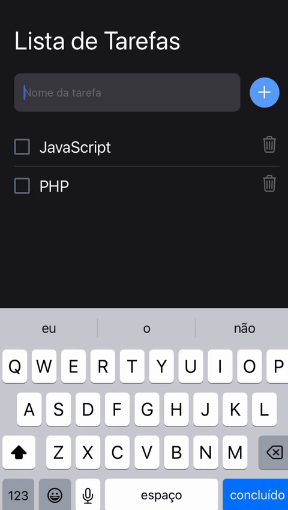

<a name="readme-top"></a>


<!-- PROJECT LOGO -->
<br />
<div align="center">
  <a href="https://github.com/edson-dantass/todolist-react-native">
    
  </a>

  <h3 align="center">TODO-LIST APP</h3>

  <p align="center">
    A simple to-do list application made in react native using expo.
  </p>
</div>


<!-- ABOUT THE PROJECT -->
## About The Project

The project consists of creating tasks and marking them as completed or removing them. This project was developed for educational purposes taught in the classroom.

<p align="right">(<a href="#readme-top">back to top</a>)</p>


### Built With

* [![ReactNative][ReactNative]][ReactNative-url]
* [![Expo.js][Expo.js]][Expo-url]


<p align="right">(<a href="#readme-top">back to top</a>)</p>


### Installation

1. Clone the repo
   ```sh
   git clone https://github.com/edson-dantass/todolist-react-native
   ```
2. Install NPM packages
   ```sh
   npm install
   ```
3. Start project
   ```sh
   npm start
   ```

<p align="right">(<a href="#readme-top">back to top</a>)</p>


<!-- ROADMAP -->
## Roadmap

- [x] Add Todo
- [x] Remove Todo
- [x] Validate empty value
- [x] Check item
- [x] Count checked items
  
<p align="right">(<a href="#readme-top">back to top</a>)</p>


<!-- CONTACT -->
## Contact

Edson Dantas - [@edson.dantass](https://www.instagram.com/edson.dantass) - edson.dantass@outlook.com

Project Link: [https://github.com/edson-dantass/todolist-react-native](https://github.com/edson-dantass/todolist-react-native)

<p align="right">(<a href="#readme-top">back to top</a>)</p>


[Expo-url]: https://expo.dev/
[Expo.js]: https://img.shields.io/badge/Expo-black?style=for-the-badge&logo=expo&logoColor=white

[ReactNative-url]: https://reactnative.dev/ 
[ReactNative]: https://img.shields.io/badge/React%20Native-20232A?style=for-the-badge&logo=react&logoColor=61DAFB
